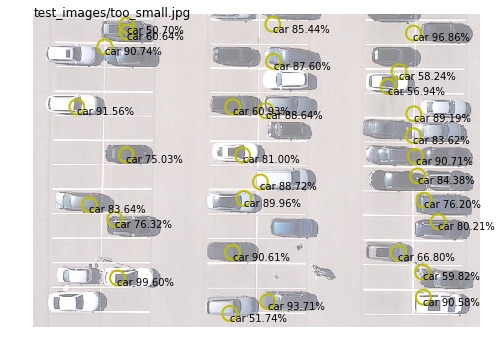

# parking-lot-demo-custom-vision

Demo for determining occupied parking spots using Azure Custom Vision.


| Input Image | Detection Results |
| ------------- |:-------------:|
| |  |

# Instructions

1. Sign up for [Custom Vision](https://www.customvision.ai) 
1. Run the notebook
1. Goto the [Custom Vision Settings](https://www.customvision.ai/projects#/settings) and copy/paste the `Training Key` and `Prediction Key`for the limited trial to the notebook in the first cell (paid subscription is currently not supported for object detection in Custom Vision):

```python
training_key = "xxxx"
prediction_key = "xxxx"
```

# Known limitations

* All cars needs to be aligned horizontally, as the detection is only trained on horizontally positioned parking spots.
* For best detection results, make sure that the cars are not too small in the images. Otherwise, Custom Vision might miss them or detect a lot of misclassifications, as shown in this image (cars on the left were not detected, or very inaccurately):


